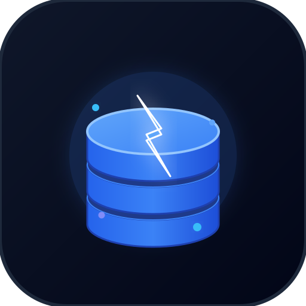

<p align="center">
  
</p>

<h1 align="center">VanillaDatabase (VanillaDB)</h1>

<p align="center">
  <strong>Multi-Tenant SQLite Cloud Engine with Realtime Event Subscriptions, Database-Scoped Media Storage, Automated Backups, and Webhooks.</strong>
</p>

<p align="center">
  <a href="#lý-do-ra-đời-why-vanilladb">Lý do ra đời</a> •
  <a href="#tính-năng-nổi-bật-key-features">Tính năng nổi bật</a> •
  <a href="#kiến-trúc-hệ-thống-architecture">Kiến trúc</a> •
  <a href="#quick-start">Quick Start</a> •
  <a href="#client-sdks">Client SDKs</a> •
  <a href="#api-reference">API Reference</a> •
  <a href="#docker-deployment">Docker Deployment</a>
</p>

---

## 💡 Lý do ra đời (Why VanillaDB?)

Khi phát triển bot Discord, Telegram, ứng dụng AI, hoặc các hệ thống microservices vừa và nhỏ:
1. **Nặng nề & phức tạp**: Các database server truyền thống như PostgreSQL hay MySQL thường tốn nhiều RAM, cấu hình connection pool phức tạp và khó sao lưu từng tenant độc lập.
2. **SQLite thuần bị giới hạn**: SQLite cực nhanh và nhẹ (WAL mode), nhưng thường chỉ dùng local trên 1 máy, thiếu REST API, thiếu bảo mật Multi-tenant, thiếu phân quyền API Token theo bảng.
3. **Thiếu Realtime & Media**: Khi cần nhận sự kiện live (SSE) hoặc lưu ảnh/video đính kèm theo database, lập trình viên thường phải cài thêm Redis, MinIO/S3, khiến hệ thống cồng kềnh.

👉 **VanillaDatabase** ra đời để giải quyết triệt để vấn đề này: **Biến SQLite thành một Cloud Database Engine hoàn chỉnh** — Nhẹ, siêu nhanh, quản lý nhiều Database độc lập, hỗ trợ HTTP REST, Batch Transactions, Realtime Events, Webhooks, và Media Storage (HTTP 206 streaming) trên một dịch vụ duy nhất!

---

## ✨ Tính năng nổi bật (Key Features)

- 🚀 **Multi-Tenant SQLite Engine**: Mỗi database là một SQLite instance độc lập (WAL Mode + Busy Timeout + Memory Cache), không lo lock toàn server.
- ⚡ **Realtime Event Stream (SSE)**: Đăng ký nhận sự kiện live `insert`, `update`, `delete`, `schema` qua Server-Sent Events (`/v1/databases/:id/realtime`).
- 📁 **Database-Scoped Media Storage**: Lưu trữ hình ảnh, video, âm thanh, tài liệu thuộc quyền quản lý của database; hỗ trợ **HTTP 206 Partial Content Range Streaming** cho video/audio mượt mà.
- 🔔 **Webhooks Subsystem**: Tự động bắn HTTP POST payload có chữ ký **HMAC-SHA256** (`X-Vanilla-Signature`) sang Discord Bot, Telegram, hoặc máy chủ backend khi dữ liệu thay đổi.
- 🛡️ **Granular API Tokens**: Cấp token linh hoạt theo quyền (`read`, `write`, `ddl`), giới hạn truy cập theo danh sách bảng (`allowedTables`, `deniedTables`), và thời hạn hết hạn.
- 📦 **Import & Export Data Engine**: Xuất/nhập trực tiếp dữ liệu dạng **SQL dump**, **CSV**, **JSON**, hoặc nạp trực tiếp file nhị phân **SQLite (.db / .sqlite)** từ Web UI.
- ⏰ **Automated Scheduled Backups**: Background cron worker tự động snapshot định kỳ (`hourly`, `daily`, `weekly`) và dọn dẹp theo thời hạn (`backup_retention`).
- 💻 **Modern Web UI Dashboard**: Giao diện quản trị trực quan với Schema Designer, Table Data Grid Browser (CRUD trực tiếp), SQL Editor, Storage Explorer, và Live Event Monitor.
- 📦 **Client SDKs**: Hỗ trợ thư viện chính thức cho cả **TypeScript / Node.js** và **Python**.

---

## 🏛️ Kiến trúc hệ thống (Architecture)

```
VanillaDatabase Architecture:
┌────────────────────────────────────────────────────────┐
│               Admin Web UI / REST Clients              │
└────────────────────────────────────────────────────────┘
                           │
       ┌───────────────────┴───────────────────┐
       ▼                                       ▼
┌─────────────────────────┐         ┌─────────────────────────┐
│ Control Plane           │         │ Data Plane              │
│ (Fastify Admin API)     │         │ (Token-Protected API)   │
└─────────────────────────┘         └─────────────────────────┘
       │                                       │
       ├─ Metadata (metadata.db)               ├─ Query / Batch Router
       ├─ Activity & Audit Logs                ├─ Realtime Service (SSE)
       ├─ Backup Scheduler                     ├─ Webhook Dispatcher
       └─ Import/Export Engine                 └─ Media Storage (Range 206)
                                                       │
                                            ┌──────────┴──────────┐
                                            ▼                     ▼
                                    SQLite DB Instances    Media Files Storage
                                    (data/databases/*.db)  (data/storage/*)
```

---

## 🚀 Quick Start

### 1. Chạy với Docker (Khuyên dùng)

```bash
docker compose up -d
```
Truy cập Web UI tại: `http://localhost:3000` (Tài khoản mặc định cấu hình trong file `docker-compose.yml` hoặc tạo mới khi khởi chạy lần đầu).

### 2. Chạy trực tiếp từ mã nguồn

**Yêu cầu**: Node.js 20+

```bash
# Cài đặt dependencies
npm install

# Khởi chạy Development mode
npm run dev

# Hoặc Build & Chạy Production
npm run build
npm start
```

---

## 📦 Client SDKs

### 1. TypeScript / Node.js Client

Cài đặt:
```bash
npm install @elaina2026/vanilladb
```

Sử dụng:
```typescript
import { VanillaDatabase } from '@elaina2026/vanilladb';

const db = new VanillaDatabase({
  url: 'http://localhost:3000/v1/databases/db_your_database_id',
  token: 'vdb_live_your_api_token_here'
});

// 1. Chạy Parameterized SQL Query
const { rows } = await db.query('SELECT * FROM users WHERE active = ?', [1]);
console.log('Users:', rows);

// 2. Chạy Batch Transaction
await db.batch([
  { sql: 'INSERT INTO users (username) VALUES (?)', params: ['alice'] },
  { sql: 'INSERT INTO logs (action) VALUES (?)', params: ['user_registered'] }
], true);

// 3. Đăng ký Realtime SSE Events
const unsubscribe = db.subscribe((event) => {
  console.log('Realtime DB Event:', event.type, event.table, event.data);
}, 'users');

// 4. Upload Media File
const file = await db.uploadFile(buffer, 'avatar.png', 'image/png');
console.log('File Streaming URL:', db.getFileUrl(file.id));
```

---

### 2. Python Client

Cài đặt:
```bash
pip install vanilladb
```

Sử dụng:
```python
from vanilladb import VanillaDatabase

db = VanillaDatabase(
    url="http://localhost:3000/v1/databases/db_your_database_id",
    token="vdb_live_your_api_token_here"
)

# 1. Parameterized Query
result = db.query("SELECT * FROM users WHERE level >= ?", [10])
print("Users:", result["rows"])

# 2. Batch Execution
db.batch([
    {"sql": "INSERT INTO users (username, score) VALUES (?, ?)", "params": ["bob", 100]},
    {"sql": "INSERT INTO logs (event) VALUES (?)", "params": ["user_added"]}
], transaction=True)

# 3. Upload File
file_info = db.upload_file("clip.mp4", filename="intro.mp4", content_type="video/mp4")
print("Stream URL:", db.get_file_url(file_info["id"]))
```

---

## 🤖 AI / RAG & Full-Text Search Support

### 1. Vector Cosine Similarity (Native Embeddings Search)
VanillaDatabase hỗ trợ các hàm vector trực tiếp trong SQL:
- `vec_cosine_similarity(vec1, vec2)`: Độ tương đồng cosine giữa 2 vector JSON (0.0 đến 1.0).
- `vec_cosine_distance(vec1, vec2)`: Khoảng cách vector cosine.

```sql
SELECT id, title, vec_cosine_similarity(embedding, '[0.12, 0.45, -0.23]') as score
FROM articles
ORDER BY score DESC
LIMIT 5;
```

### 2. Full-Text Search (FTS5)
```sql
CREATE VIRTUAL TABLE documents_fts USING fts5(title, content);
INSERT INTO documents_fts (title, content) VALUES ('Hướng dẫn VanillaDB', 'SQLite Cloud Engine siêu tốc');
SELECT * FROM documents_fts WHERE documents_fts MATCH 'VanillaDB';
```

---

## 💡 Code Examples

Mã nguồn mẫu ứng dụng thực tế có sẵn tại thư mục `examples/`:
- [`examples/discord-bot-nodejs`](examples/discord-bot-nodejs/): Bot Discord lưu exp/level, daily rewards và realtime event sync.
- [`examples/telegram-bot-python`](examples/telegram-bot-python/): Bot Telegram lưu dữ liệu và upload ảnh media vào VanillaDB.
- [`examples/nextjs-crud-app`](examples/nextjs-crud-app/): Fullstack Next.js app CRUD dữ liệu qua `@elaina2026/vanilladb`.

---

## 📡 API Reference

### Data Plane (Xác thực bằng `Authorization: Bearer <API_TOKEN>`)

| Phương thức | Endpoint | Mô tả |
| :--- | :--- | :--- |
| `POST` | `/v1/databases/:id/query` | Thực thi câu lệnh SQL có tham số |
| `POST` | `/v1/databases/:id/batch` | Chạy nhiều câu lệnh SQL trong Transaction |
| `GET` | `/v1/databases/:id/realtime` | Server-Sent Events (SSE) stream nhận sự kiện live |
| `GET` | `/v1/databases/:id/files` | Danh sách files media thuộc database |
| `POST` | `/v1/databases/:id/files` | Tải lên file media mới (Multipart form-data) |
| `GET` | `/v1/files/:fileId/view` | Xem/stream file media (**HTTP 206 Partial Content**) |

---

## 🧪 Testing

Dự án đi kèm bộ Integration Test toàn diện kiểm tra đầy đủ tính năng:
```bash
npm test
```

---

## 📄 License

Phát hành dưới giấy phép [MIT License](LICENSE).
Copyright (c) 2026 Elaina2026.
