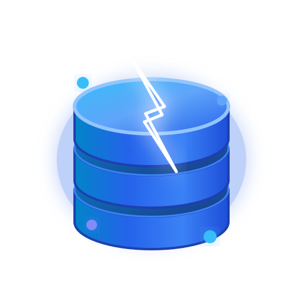

<p align="center">
  
</p>

<h1 align="center">VanillaDatabase (VanillaDB)</h1>

<p align="center">
  <strong>Enterprise-Grade Multi-Tenant SQLite Cloud Engine with High-Performance REST & SQL APIs, Live Server-Sent Events (SSE), Database-Scoped Media Streaming (HTTP 206), AES-256-GCM Encryption at Rest, Automated Backups, and Native Vector Mathematics.</strong>
</p>

<p align="center">
  <a href="LICENSE"></a>
  <a href="https://nodejs.org"></a>
  <a href="https://www.typescriptlang.org/"></a>
  <a href="https://fastify.dev/"></a>
  <a href="https://github.com/WiseLibs/better-sqlite3"></a>
  <a href="package.json"></a>
  <a href="tests/"></a>
</p>

<p align="center">
  <strong>[ <a href="#overview">Overview</a> ]</strong> &bull;
  <strong>[ <a href="README.vi.md">Phiên bản Tiếng Việt</a> ]</strong> &bull;
  <strong>[ <a href="#architecture">Architecture</a> ]</strong> &bull;
  <strong>[ <a href="#key-capabilities">Key Capabilities</a> ]</strong> &bull;
  <strong>[ <a href="#quickstart">Quickstart</a> ]</strong> &bull;
  <strong>[ <a href="#security-model">Security Model</a> ]</strong> &bull;
  <strong>[ <a href="#api-reference">API Reference</a> ]</strong> &bull;
  <strong>[ <a href="#keyboard-shortcuts">Shortcuts</a> ]</strong> &bull;
  <strong>[ <a href="docs/README.md">Documentation Suite</a> ]</strong>
</p>

---

## Overview

VanillaDatabase (VanillaDB) is a self-hosted, lightweight multi-tenant SQLite cloud platform engineered with Node.js 22+ and Fastify.

Rather than running monolithic database clusters for every client, project, or microservice, VanillaDatabase dynamically provisions and orchestrates **isolated SQLite database instances** on disk. Each tenant database functions as an independent storage unit with dedicated Write-Ahead Logging (WAL), scoped API tokens, encrypted backups, media storage, asynchronous webhooks, and live event streams.

> [!NOTE]
> **Isolation Guarantee:** All tenant databases operate with strict filesystem isolation under `data/databases/:id.sqlite`. System metadata is partitioned separately under `data/system/vanilladb.sqlite`.

---

## Architecture

```
                       +-----------------------------------+
                       |       HTTP / SSE Client Layer     |
                       | (Browser Dashboard, SDKs, Scripts)|
                       +-----------------+-----------------+
                                         |
                                         v
                       +-----------------------------------+
                       |    Fastify HTTP Server (Port 3000)|
                       |   - Helmet Security & Strict CSP  |
                       |   - Session HMAC & Token Auth     |
                       |   - Rate Limiter & SSRF Firewall  |
                       +-----------------+-----------------+
                                         |
         +-------------------------------+-------------------------------+
         |                               |                               |
         v                               v                               v
+-----------------+             +-----------------+             +-----------------+
|  Control Plane  |             |   Data Plane    |             |   Storage & SSE |
|  /api/admin/*   |             |   /v1/databases |             |  /v1/databases/ |
|  /api/auth/*    |             |   /:id/query    |             |  :id/storage    |
+--------+--------+             +--------+--------+             +--------+--------+
         |                               |                               |
         v                               v                               v
+-----------------+             +-----------------+             +-----------------+
| System Metadata |             |  Tenant Engine  |             |  Encrypted Media|
| (better-sqlite3)|             | (Pooled Handles)|             |  (AES-256-GCM)  |
| - Users & Roles |             | - WAL Mode      |             | - HTTP 206      |
| - DB Members    |             | - AI Vector Math|             | - Range Seek    |
| - Tokens & Logs |             | - Foreign Keys  |             | - Zero-Leak     |
+-----------------+             +-----------------+             +-----------------+
```

---

## Key Capabilities

###  Multi-Tenant SQLite Orchestration
- Dynamic creation of dedicated SQLite databases identified by nanoid (`db_<nanoid>`).
- Native Write-Ahead Logging (WAL mode), busy-timeout retry handling, foreign key enforcement, and memory-cached connection pooling.
- AI vector distance and similarity functions (`vec_cosine_similarity()`, `vec_cosine_distance()`) registered natively.
- Cryptographic SQL functions: `encrypt_aes()`, `decrypt_aes()`, `hash_sha256()`, `hash_hmac()`.

###  OWASP Hardened & Cryptographic Defense
- **Session Revocation (VDB-SEC-01):** HMAC cookie signatures bind user `token_version`. Password changes and account disabling revoke active sessions immediately across all clients.
- **TOTP Replay Protection (VDB-SEC-02):** Monotonic time-step tracking enforcing RFC 6238 Section 5.2. OTP codes cannot be reused within the 90-second drift tolerance window.
- **SSRF Network Blocker:** Outbound webhooks block loopback (`127.0.0.0/8`), private subnets (RFC 1918), link-local addresses, and cloud metadata endpoints (`169.254.169.254`).
- **Data-at-Rest Encryption:** AES-256-GCM envelope encryption with authenticated headers (`VENC` signature, PBKDF2 salt, 128-bit authentication tag).
- **Engine Sandboxing:** `ATTACH DATABASE`, `DETACH DATABASE`, and binary extension loading (`load_extension`) are permanently disabled.

###  Multi-User Access Control & Quotas
- Three system roles: `super_admin`, `admin`, `user`.
- Database membership roles: `owner`, `admin`, `editor`, `viewer`.
- Granular database quantity quotas (`max_databases`) and per-user request throttling (`rate_limit_per_minute`).
- Self-service registration with automatic quota assignment.

###  Scoped Token System
- Generate tokens prefixed with `vdb_live_*` or `vdb_test_*`.
- Granular scopes: `database:read`, `database:write`, `database:ddl`, `database:admin`.
- Table-level allowlists and denylists.
- Raw tokens are never stored; only SHA-256 hashes are persisted in system metadata.

###  Server-Sent Events & Webhooks
- SSE streaming endpoint at `/v1/databases/:id/realtime` dispatching database mutations (`insert`, `update`, `delete`, `schema`).
- Webhook dispatcher with HMAC-SHA256 request signing (`X-Vanilla-Signature`), payload retries, and Discord/Slack formatting.

###  Media Assets & HTTP 206 Streaming
- Database-scoped file storage with transparent chunked encryption.
- HTTP 206 Partial Content range requests for audio and video scrubbing.

###  Enterprise Dashboard & Bilingual Matrix
- Modern single-page management console built with React 19, Tailwind CSS v4, Lucide icons, and Monaco SQL Editor.
- Complete bilingual support (English & Tiếng Việt) across all pages and notifications.
- Integrated keyboard shortcuts: Vim chords (`G+D`, `G+I`), collapsible sidebar (`Ctrl+\`), SQL console operations (`Ctrl+Enter`, `Ctrl+E`, `Ctrl+S`, `Alt+Up/Down`, `F11`), and table browser hotkeys (`Alt+I`, `Alt+R`, `[`, `]`, `/`, `Del`).

---

## Quickstart

### Prerequisites
- Node.js 22.0.0 or higher
- npm 10.0.0 or higher

### 1. Clone & Install
```bash
git clone https://github.com/Elaina2026/VanillaDB.git
cd VanillaDB
npm install
```

### 2. Configure Environment
```bash
cp .env.example .env
```

Review core variables in `.env`:
```env
PORT=3000
HOST=0.0.0.0
NODE_ENV=production
VDB_MASTER_KEY=generate_a_secure_64_character_hex_key
VDB_SESSION_SECRET=generate_a_secure_64_character_hex_key
VDB_CORS_ORIGINS=http://localhost:3000
```

### 3. Build & Run
```bash
# Build frontend and server bundles
npm run build

# Start production server
npm start
```

For development with hot reloading:
```bash
npm run dev
```

The web dashboard is accessible at `http://localhost:3000`.

---

## Configuration Reference

| Variable | Type | Default | Description |
| :--- | :--- | :--- | :--- |
| `PORT` | number | `3000` | HTTP listening port |
| `HOST` | string | `0.0.0.0` | Network binding interface |
| `NODE_ENV` | string | `development` | Runtime environment (`development`, `production`, `test`) |
| `VDB_MASTER_KEY` | string | Auto-generated | 256-bit encryption key for database and media encryption |
| `VDB_SESSION_SECRET` | string | Auto-generated | HMAC secret for session cookies and temporary tokens |
| `VDB_CORS_ORIGINS` | string | `*` | Allowed CORS origins (comma-separated for multiple domains) |
| `VDB_DATA_DIR` | string | `./data` | File storage path for SQLite databases, backups, and media |
| `VDB_MAX_REQUEST_SIZE_MB` | number | `10` | Maximum body size for SQL requests and payload imports |
| `VDB_STORAGE_MAX_FILE_SIZE_MB` | number | `100` | Maximum file size for media asset uploads |
| `VDB_STORAGE_ENCRYPTION` | boolean | `true` | Enable AES-256-GCM encryption for stored media files |
| `VDB_DEFAULT_USER_MAX_DATABASES` | number | `2` | Default database quota for newly registered users |
| `VDB_DEFAULT_USER_RATE_LIMIT` | number | `180` | Default request-per-minute quota for regular users |

---

## API Reference

### Data Plane (Tenant Database Operations)

All Data Plane endpoints require authentication via Bearer API token (`Authorization: Bearer vdb_live_...`) or active session cookie.

```bash
# Execute SQL Query (SELECT)
POST /v1/databases/:databaseId/query
Content-Type: application/json

{
  "sql": "SELECT id, username, email FROM users WHERE status = ? LIMIT 10;",
  "params": ["active"]
}
```

```bash
# Execute SQL Mutation (INSERT, UPDATE, DELETE)
POST /v1/databases/:databaseId/exec
Content-Type: application/json

{
  "sql": "UPDATE users SET status = ? WHERE id = ?;",
  "params": ["verified", "usr_123"]
}
```

```bash
# Transactional Batch Execution
POST /v1/databases/:databaseId/batch
Content-Type: application/json

{
  "transaction": true,
  "statements": [
    { "sql": "UPDATE accounts SET balance = balance - 100 WHERE id = ?;", "params": ["acc_a"] },
    { "sql": "UPDATE accounts SET balance = balance + 100 WHERE id = ?;", "params": ["acc_b"] }
  ]
}
```

```bash
# Connect to Live Realtime SSE Stream
GET /v1/databases/:databaseId/realtime
Accept: text/event-stream
```

```bash
# Stream Media File with Range Support
GET /v1/databases/:databaseId/storage/:fileId
Range: bytes=0-1048575
```

### Control Plane (Administrative & Security Endpoints)

| Method | Endpoint | Access | Purpose |
| :--- | :--- | :--- | :--- |
| `POST` | `/api/auth/register` | Public | Self-service user account registration |
| `POST` | `/api/auth/login` | Public | User authentication and session cookie generation |
| `POST` | `/api/auth/login/2fa` | Public | Step-up 2FA verification with TOTP code or backup code |
| `POST` | `/api/auth/change-password` | Authenticated | Password update with automatic session revocation |
| `GET` | `/api/admin/databases` | Authenticated | List accessible tenant databases |
| `POST` | `/api/admin/databases` | Authenticated | Create a new tenant database |
| `POST` | `/api/admin/databases/:id/clone` | Admin / Owner | Clone database instance for branching |
| `POST` | `/api/admin/databases/:id/backups` | Admin / Owner | Trigger instant encrypted backup snapshot |
| `POST` | `/api/admin/databases/:id/maintenance` | Admin / Owner | Execute `integrity_check`, `vacuum`, or `optimize` |
| `GET` | `/api/system/status` | Super Admin | Realtime CPU, RAM, and host disk space telemetry |

---

## Keyboard Shortcuts

VanillaDatabase features a comprehensive shortcut matrix accessible from anywhere in the platform:

| Context | Shortcut | Action (English) | Thao tác (Tiếng Việt) |
| :--- | :--- | :--- | :--- |
| **Global** | `Ctrl + K` | Open Command Palette | Mở thanh tìm kiếm lệnh nhanh |
| **Global** | `Ctrl + B` | Open Create Database modal | Mở cửa sổ tạo cơ sở dữ liệu mới |
| **Global** | `Ctrl + \` | Toggle desktop sidebar collapse | Thu gọn / Mở rộng Sidebar điều hướng |
| **Global** | `G` then `D` | Navigate to Databases (Vim chord) | Về danh sách Database (Vim chord) |
| **Global** | `G` then `I` | Navigate to Inbox (Vim chord) | Mở Hộp thư thông báo (Vim chord) |
| **Global** | `Ctrl + Shift + L` | Toggle language (EN / VI) | Chuyển đổi ngôn ngữ (EN / VI) |
| **Global** | `Alt + T` | Toggle theme (Light / Dark) | Chuyển đổi giao diện Sáng / Tối |
| **Global** | `Shift + ?` | Open Shortcuts reference page | Mở trang tra cứu phím tắt |
| **DB Detail** | `1` .. `9` | Switch database detail tabs | Chuyển nhanh qua lại các tab Database |
| **SQL Console** | `Ctrl + Enter` | Execute SQL statement | Thực thi câu lệnh SQL đang soạn |
| **SQL Console** | `Ctrl + E` | Analyze EXPLAIN query plan | Phân tích kế hoạch truy vấn EXPLAIN |
| **SQL Console** | `Ctrl + S` | Export query results to CSV | Tải kết quả truy vấn ra file CSV |
| **SQL Console** | `Alt + Up / Down` | Browse query execution history | Duyệt lịch sử câu lệnh SQL đã chạy |
| **SQL Console** | `Ctrl + /` | Toggle SQL line comment (`--`) | Bật/tắt comment dòng lệnh SQL |
| **SQL Console** | `F11` / `Esc` | Toggle Fullscreen Zen Mode | Bật/tắt chế độ toàn màn hình Zen Mode |
| **Table Browser**| `Alt + I` | Open Insert Row modal | Mở modal chèn dòng dữ liệu mới |
| **Table Browser**| `Alt + R` | Refresh table rows and schema | Tải lại dữ liệu bảng và schema |
| **Table Browser**| `[` / `]` | Previous / Next page | Lùi trang / Tiến trang dữ liệu |
| **Table Browser**| `/` | Focus table search input | Nhảy nhanh vào ô tìm kiếm bảng |
| **Table Browser**| `Del` | Bulk delete selected rows | Xóa các dòng dữ liệu đang chọn |
| **DB Actions** | `Ctrl + Shift + B`| Create instant backup snapshot | Tạo bản sao lưu tức thì |
| **DB Actions** | `Ctrl + Shift + D`| Open Clone Database modal | Mở modal nhân bản Database |
| **DB Actions** | `Alt + M` | Run `PRAGMA integrity_check` | Chạy kiểm tra toàn vẹn cơ sở dữ liệu |

---

## Testing & Quality Assurance

The test suite runs with Vitest and executes end-to-end assertions against the server instance:

```bash
# Run complete test suite (94 integration & unit tests)
npm test

# Run TypeScript typecheck
npm run typecheck

# Run performance benchmarks
npm run benchmark
```

All 94 tests cover:
- Multi-user RBAC, sub-account limits, and quota caps.
- 2FA TOTP activation, backup codes lifecycle, and step-up login challenges.
- Session revocation on credential update (VDB-SEC-01).
- Monotonic time-step TOTP replay rejection (VDB-SEC-02).
- AES-256-GCM envelope encryption and PBKDF2 key derivation.
- SQL syntax translation from MySQL, PostgreSQL, CSV, and NDJSON.
- Transactional batch executions and rollback safety.
- HTTP 206 Partial Content range audio/video streaming.

---

## Documentation Suite

For detailed technical guides, visit the documentation directories:

- **Documentation Hub**: [docs/README.md](docs/README.md)
- **English Guides**:
  - [01. Getting Started](docs/en/01-getting-started.md)
  - [02. Architecture & Design](docs/en/02-architecture.md)
  - [03. Database Engine](docs/en/03-database-engine.md)
  - [04. REST & SQL API](docs/en/04-api-reference.md)
  - [05. Authentication & RBAC](docs/en/05-authentication-rbac-2fa.md)
  - [06. Realtime & Webhooks](docs/en/06-realtime-and-webhooks.md)
  - [07. Storage & Streaming](docs/en/07-storage-and-streaming.md)
  - [08. Backup & Maintenance](docs/en/08-backup-and-restore.md)
  - [09. Migration & Import](docs/en/09-migration-and-converter.md)
  - [10. Production Deployment](docs/en/10-deployment.md)
  - [11. Troubleshooting & FAQ](docs/en/11-troubleshooting.md)
  - [12. Development Guide](docs/en/12-development.md)
- **Tài liệu Tiếng Việt**:
  - [01. Bắt đầu nhanh](docs/vi/01-getting-started.md)
  - [02. Kiến trúc hệ thống](docs/vi/02-architecture.md)
  - [03. Động cơ cơ sở dữ liệu](docs/vi/03-database-engine.md)
  - [04. Tham chiếu REST API](docs/vi/04-api-reference.md)
  - [05. Phân quyền & 2FA](docs/vi/05-authentication-rbac-2fa.md)
  - [06. Sự kiện & Webhooks](docs/vi/06-realtime-and-webhooks.md)
  - [07. Lưu trữ Media & Luồng](docs/vi/07-storage-and-streaming.md)
  - [08. Sao lưu & Bảo trì](docs/vi/08-backup-and-restore.md)
  - [09. Di chuyển dữ liệu](docs/vi/09-migration-and-converter.md)
  - [10. Triển khai Production](docs/vi/10-deployment.md)
  - [11. Xử lý sự cố & FAQ](docs/vi/11-troubleshooting.md)
  - [12. Hướng dẫn phát triển](docs/vi/12-development.md)

---

## License

VanillaDatabase is open-source software licensed under the [MIT License](LICENSE).
